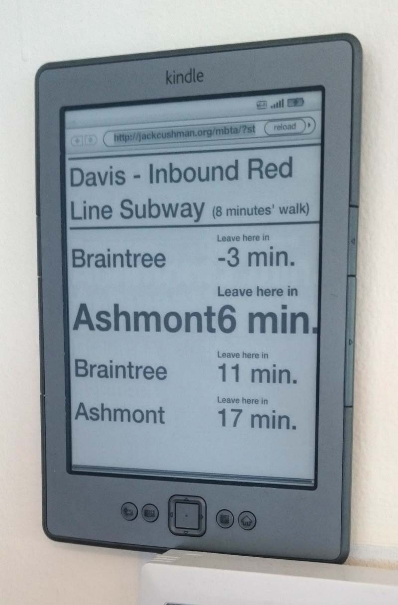

This is a single-page Javascript app for the Boston MBTA. It tells you when to leave to catch the next
train or bus, based on your walking time to your stop.

It's good for running on an old Kindle near your front door:

See it in action at [http://jackcushman.org/mbta/](http://jackcushman.org/mbta/)